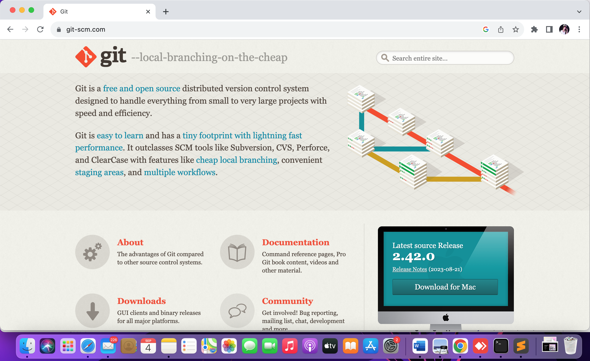
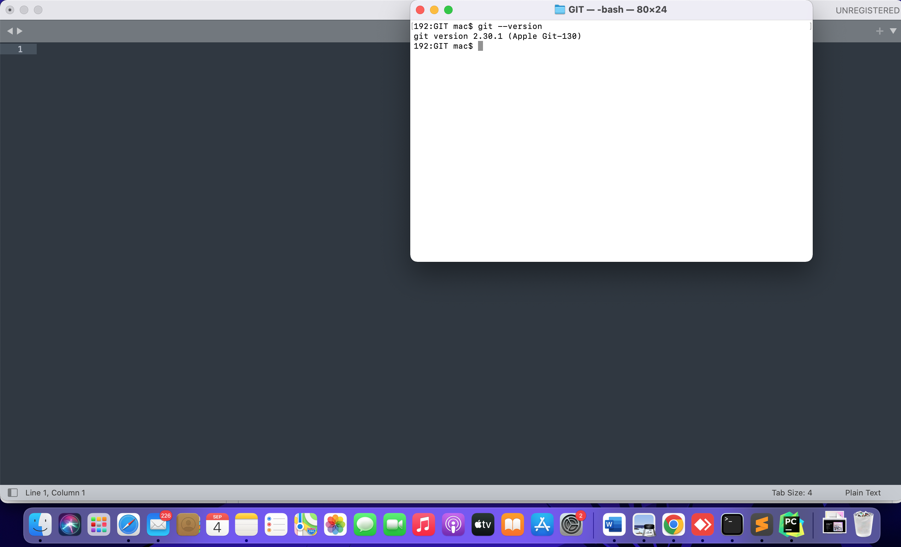
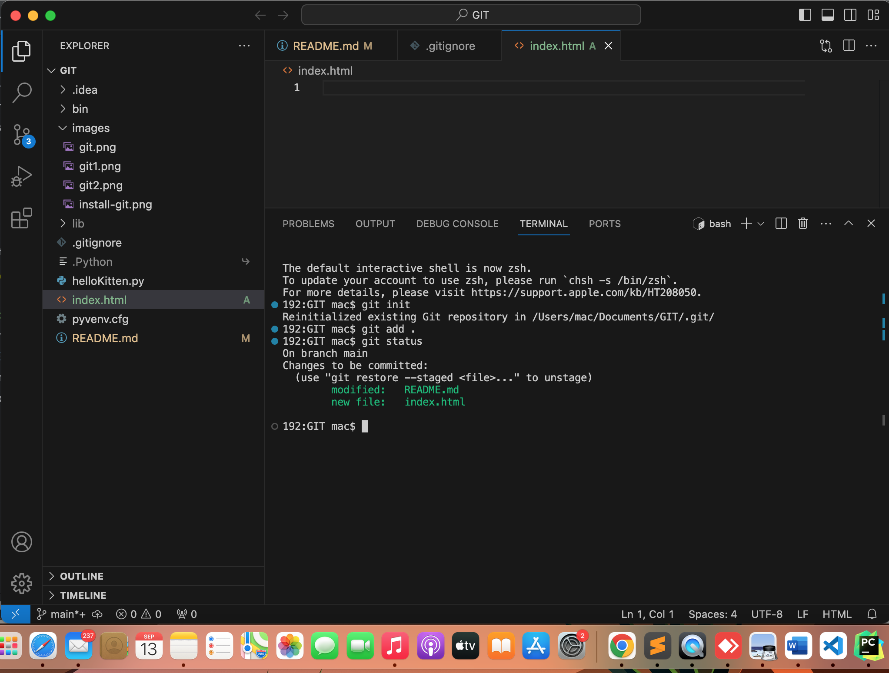
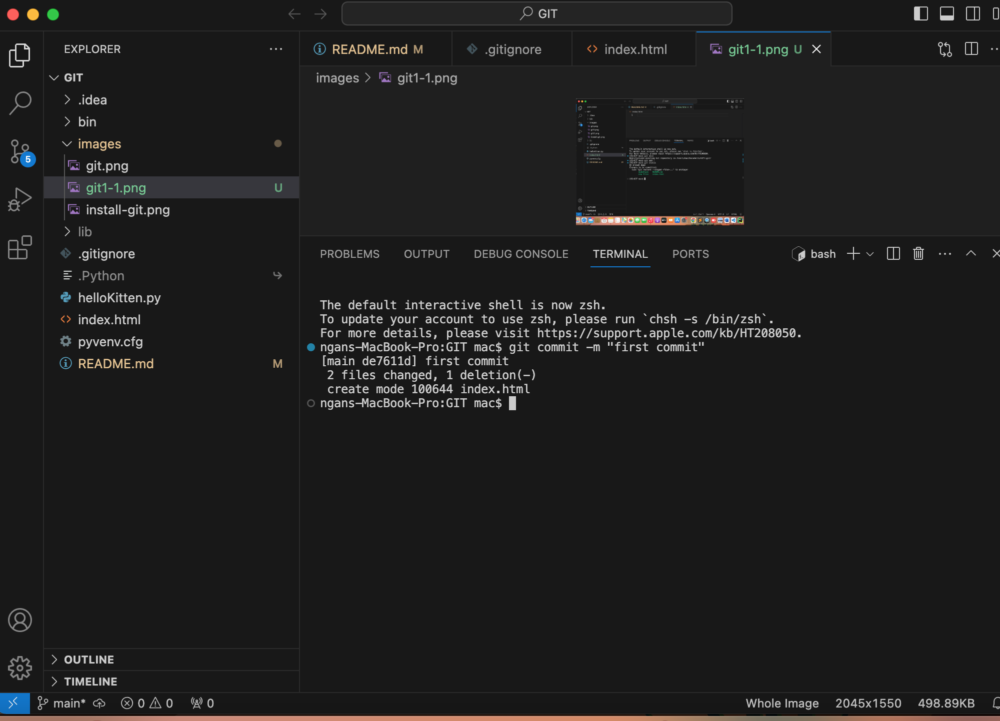
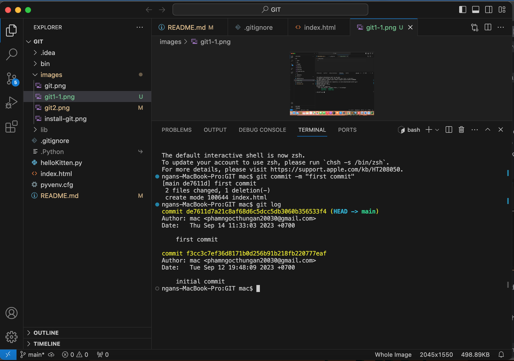
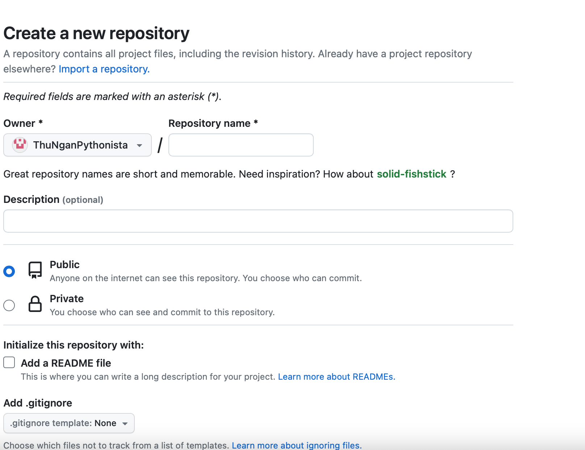
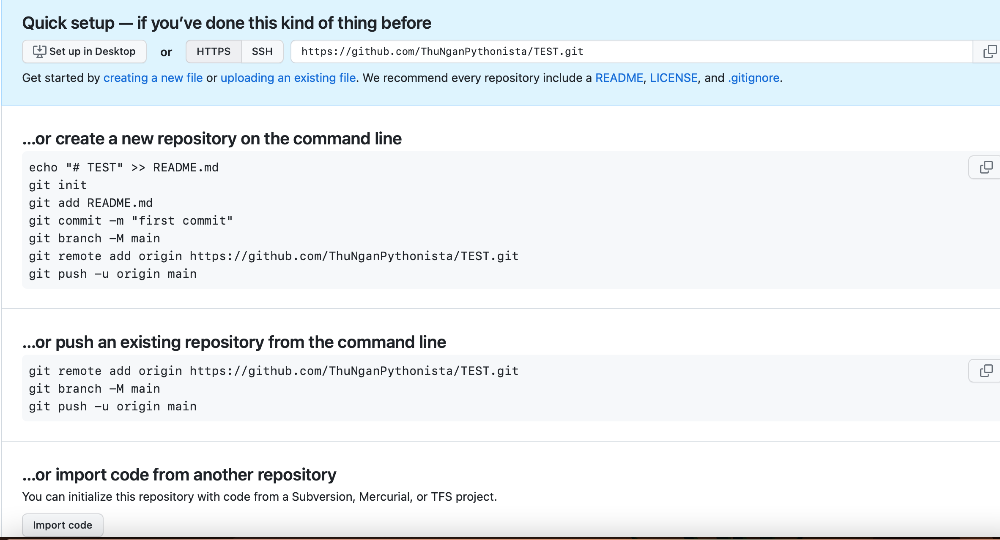

# GIT TUTORIAL #

*Git is Distributed Version Control System. It allows us to store changed versions of the project and go back to any version that has been saved. This system can be used by many people to work together on the same source code. And each person will have their own version of the source code. These separate versions can then be merged into the main version of the project.*

* It'll be easier when you already learnt Linux

### SECTION 1: INSTALL GIT AND RUN SOME BASIC COMMANDS TO PUSH YOUR PROJECT TO GITHUB ###

Firstly, you need to install GIT in your computer ! 

Install here : https://git-scm.com

Next, we will check whether it was installed or not.
You open cmd on Window or terminal on MacOs to check by the code `git --version`:

If it was like this, you did correctly :

### BASIC GIT COMMANDS ###

I can use Terminal in Visual Code Studio to code If you do not remember `Linux commands`

`git init`  : initialize a git repository local right in your folder

 Now, you ALREADY CREATED a file `.git`  your folder
The file `.git` has been indicated in your project

`git add .` : it means like the meaning in English "add". You wanna anything, any files by using this commands. In this case, I use `.` meaning that add ALL. The format is `git add <file name>`. By the way, you can exclude any files by using `.gitignore`. I will tell you clearly later in this tutorial

Okay !! There is one more step after `git add`.

You must commit changes by : `git commit -m “<any-contents-here>” `

Take note double quotation mark required, for example : `git commit -m “first commit”`

### *Take note :*  ###
Coppy code and paste can cause error due to double quotation marks, so you should type double quotation mark by yourself better.

Done If your output exactly looks the same as mine !!! 

Now, you can check to be sure. Check commit : `git log`

Here, it will display the commit ID (automatically generated by Git, which may be needed later), the commit author, commit time, and commit message.

Ta da! So, it's been saved. Now, let's move on to the next part, which is uploading the code to GitHub.

## *Let's Upload The Code to GitHub* # 

- Firstly, you should sign in GitHub Account : https://github.com/ . Please sign up If you don't have

- Secondly, click the button `New` after logged in :

- Thirdly, After clicked, you will see this interface :

Now, fill in necessary information :

 + Repository name : You name for your repo
 + Description : you describe your repo
 + Public or Private : Everyone will see your repo (public) or won't see (private)
 + Initialize files : README.md, .gitignore, license

Click "create repository" and then will see the next interface :

Here, you see two instructions : create repo on the top and push an existing repo. Because we already created repo, we can ignore the first one. The second one is guidelines to push your local project to GitHub

- Now, you continue to code at your terminal, followed by 3 guidelines below. You just need to coppy and paste sequentially. For example, mine :
 
    `git remote add origin https://github.com/ThuNganPythonista/TEST.git`

  and then .. :

    `git push -u origin main`

  The output looks like this :

  

  Now, your complete project is available on your repo GitHub already !!

### SECTION 2: Clone and Run a Django Project from Github ###

**(1)Git clone** : you create a coppy of the project on Github. You clone it into your local desktop, for example.

`git clone <URL of repo> ` 

I succesfully clone melyoj project to my local desktop ngans-MacBook-Pro

**(2) Create a Virtual Environment:** 

It allows you to comfortably install, uninstall, and set up different versions with Python packages without worrying about affecting existing projects.

`python3 -m venv env`

Virtualenv is a tool that allows you create and manage independent virtual environments for each project.

**(3)Activate the virtual environment:**

You alr created virtual environment, now run it :

`source env/bin/activate`

After successful activation, at the beginning of the path, you will see the name of the virtual environment enclosed in parentheses (env).

**(4) Deploy The Project:**

Now, you move to that project by using the command `cd` :

Now, you need to install the libraries and dependencies listed in the requirements.txt file into your Python environment. Run :

`pip install -r requirements.txt`

Tadaaaaaa, This is my final result :

### SECTION 3 : GIT BRANCH, WHAT IZIT ? ###

A bit same as the role of git-clone in section 2 is somewhat similar to what project's members code independently, not affecting the main branch of project. These branches can consolidate by the command `merge`.

### SOME COMMON GIT ERRORS
  
  ###### Message 'src refspec master does not match any'

  This error has two cases :
   + (1) No commit on master branch
   + (2) the name of local branch which is different from remote branch

  Debug :

  1. Check the status of master branch :
 
     `git status`

  2. If the output on terminal result like this :
 
     

 => Ya sure, your branch has no commit ! It means that you do not upload anything to your repo Github.

 But why you already run `git add .` ?

 The secret that Google and ChatGPT never tell you is hidden in `gitignore` file.

 Some project automatically created `gitignore` file, having (*) that means ignore EVERYTHING. Just delete it and run commands as usual, It will work !!!

 With MacOs, you must go to your finder and locate your project, run `command` + `shift` + `.` to show hidden git file.

 

